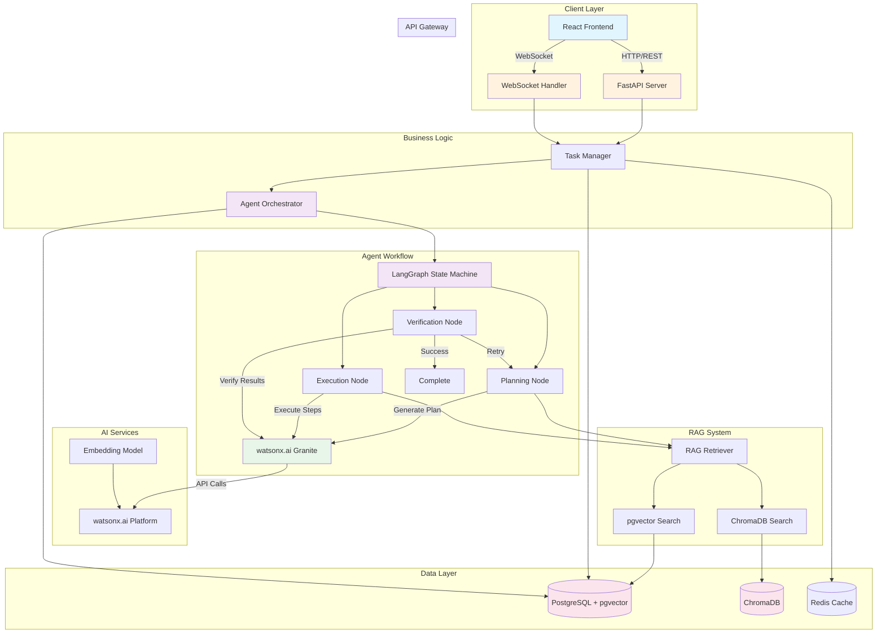
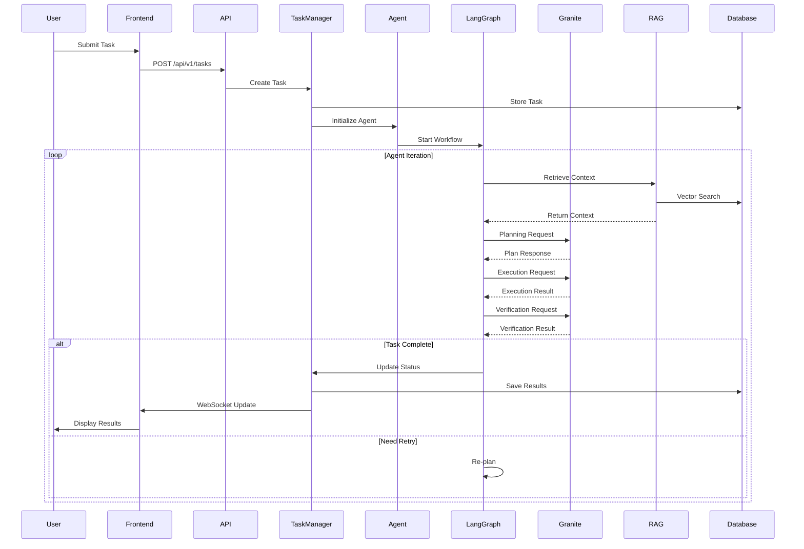
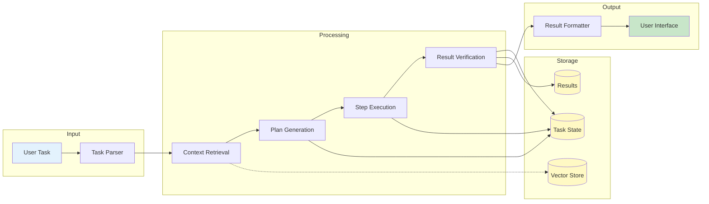
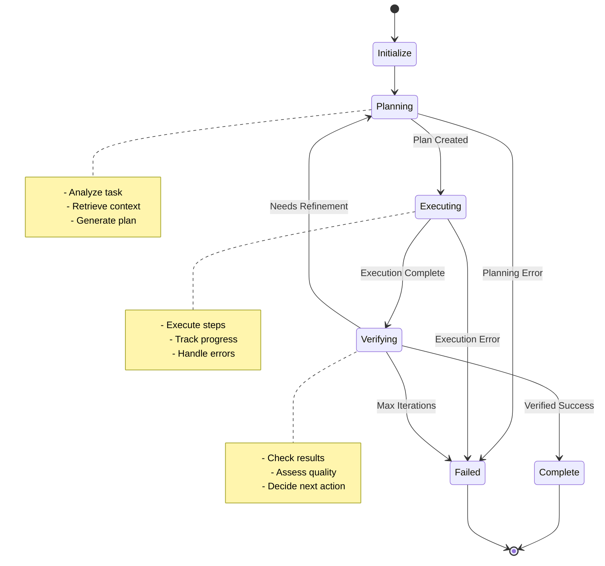
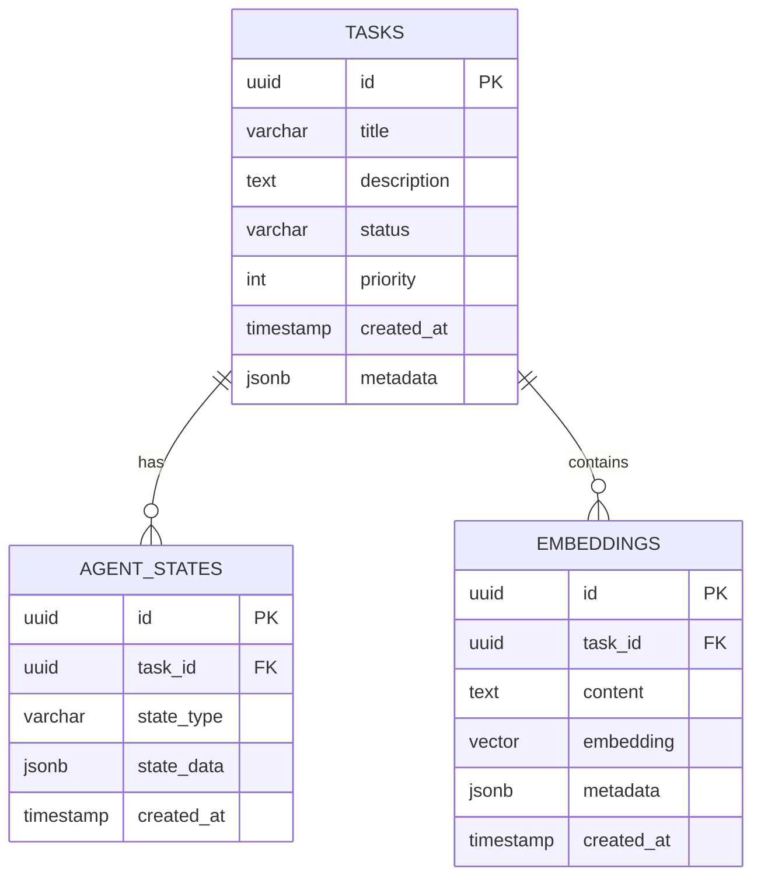

# AI Task Completion Agent - Architecture Overview

## System Architecture Diagram



## Component Interaction Flow



## Data Flow Architecture



## Technology Stack Details

### Backend Stack
```
FastAPI (Web Framework)
├── Uvicorn (ASGI Server)
├── Pydantic (Data Validation)
├── SQLAlchemy (ORM)
│   └── Alembic (Migrations)
├── LangGraph (Agent Framework)
│   └── LangChain (LLM Integration)
├── watsonx.ai SDK
│   └── Granite LLM
├── PostgreSQL + pgvector
│   └── asyncpg (Async Driver)
├── ChromaDB (Vector Store)
└── Redis (Caching/Sessions)
```

### Frontend Stack
```
React 18
├── TypeScript
├── Vite (Build Tool)
├── TanStack Query (Data Fetching)
├── Zustand (State Management)
├── Axios (HTTP Client)
├── Socket.io (WebSocket)
├── Tailwind CSS (Styling)
└── React Markdown (Rendering)
```

## Agent Workflow State Machine



## Database Schema

### Core Tables

**tasks**
- `id` (UUID, PK)
- `title` (VARCHAR)
- `description` (TEXT)
- `status` (VARCHAR)
- `priority` (INTEGER)
- `created_at` (TIMESTAMP)
- `updated_at` (TIMESTAMP)
- `completed_at` (TIMESTAMP)
- `metadata` (JSONB)

**agent_states**
- `id` (UUID, PK)
- `task_id` (UUID, FK → tasks)
- `state_type` (VARCHAR)
- `state_data` (JSONB)
- `created_at` (TIMESTAMP)

**embeddings**
- `id` (UUID, PK)
- `task_id` (UUID, FK → tasks)
- `content` (TEXT)
- `embedding` (VECTOR(1536))
- `metadata` (JSONB)
- `created_at` (TIMESTAMP)

### Relationships



## API Endpoints

### Task Management
- `POST /api/v1/tasks` - Create new task
- `GET /api/v1/tasks/{id}` - Get task details
- `GET /api/v1/tasks` - List all tasks
- `PUT /api/v1/tasks/{id}` - Update task
- `DELETE /api/v1/tasks/{id}` - Delete task

### Agent Operations
- `POST /api/v1/agents/execute` - Execute agent workflow
- `GET /api/v1/agents/status/{task_id}` - Get agent status
- `POST /api/v1/agents/stop/{task_id}` - Stop agent execution

### WebSocket
- `WS /ws/tasks/{task_id}` - Real-time task updates

### Health & Monitoring
- `GET /api/v1/health` - Health check
- `GET /api/v1/metrics` - System metrics

## Security Considerations

### Authentication & Authorization
- API key authentication for watsonx.ai
- Session-based authentication for users
- JWT tokens for API access
- Role-based access control (future)

### Data Protection
- Environment variables for secrets
- Encrypted database connections
- HTTPS for production
- Input validation and sanitization

### Rate Limiting
- API rate limiting per user
- LLM call throttling
- WebSocket connection limits

## Performance Optimization

### Caching Strategy
- Redis for session data
- Query result caching
- Vector embedding caching
- LLM response caching (when appropriate)

### Database Optimization
- Indexed columns for fast queries
- Vector similarity index (IVFFlat)
- Connection pooling
- Async database operations

### Frontend Optimization
- Code splitting
- Lazy loading components
- Optimistic UI updates
- WebSocket connection management

## Monitoring & Logging

### Logging Levels
- **DEBUG**: Detailed diagnostic information
- **INFO**: General informational messages
- **WARNING**: Warning messages for potential issues
- **ERROR**: Error messages for failures
- **CRITICAL**: Critical issues requiring immediate attention

### Metrics to Track
- Task completion rate
- Average task duration
- Agent iteration count
- LLM API latency
- Database query performance
- WebSocket connection count
- Error rates by component

### Log Structure
```json
{
  "timestamp": "2026-05-16T05:22:50.046Z",
  "level": "INFO",
  "component": "agent.planning",
  "task_id": "uuid",
  "message": "Plan generated successfully",
  "metadata": {
    "steps": 5,
    "duration_ms": 1234
  }
}
```

## Deployment Architecture

### Local Development
```
Docker Compose
├── PostgreSQL Container
├── Redis Container
├── Backend Container
│   └── FastAPI + Uvicorn
└── Frontend Container
    └── Vite Dev Server
```

### Production (Future)
```
Cloud Infrastructure
├── Load Balancer
├── Application Servers (Auto-scaling)
│   └── FastAPI Instances
├── Database Cluster
│   ├── Primary PostgreSQL
│   └── Read Replicas
├── Redis Cluster
├── Vector Store
│   └── ChromaDB Cluster
└── Monitoring Stack
    ├── Prometheus
    ├── Grafana
    └── ELK Stack
```

## Error Handling Strategy

### Agent Errors
- **Planning Failure**: Retry with simplified prompt
- **Execution Error**: Log and attempt recovery
- **Verification Failure**: Re-plan with feedback
- **Timeout**: Save state and notify user

### System Errors
- **Database Connection**: Retry with exponential backoff
- **LLM API Error**: Fallback to cached responses
- **WebSocket Disconnect**: Auto-reconnect
- **Memory Overflow**: Implement pagination

## Extension Points

### Future Enhancements
1. **Multi-Model Support**: Add OpenAI, Anthropic, etc.
2. **Tool Integration**: File operations, web search, code execution
3. **Multi-Agent Collaboration**: Specialized agents for different tasks
4. **Human-in-the-Loop**: Manual approval for critical steps
5. **Advanced RAG**: Graph RAG, hybrid search
6. **Workflow Templates**: Pre-defined task templates
7. **Analytics Dashboard**: Task insights and trends
8. **API Integrations**: Connect to external services
9. **Voice Interface**: Speech-to-text task input
10. **Mobile App**: Native mobile clients

## Development Guidelines

### Code Style
- Follow PEP 8 for Python
- Use ESLint + Prettier for TypeScript
- Type hints for all Python functions
- Comprehensive docstrings
- Meaningful variable names

### Git Workflow
- Feature branches from main
- Pull requests for all changes
- Code review required
- Automated tests must pass
- Semantic commit messages

### Testing Requirements
- Unit tests for all functions
- Integration tests for APIs
- E2E tests for critical flows
- Minimum 80% code coverage
- Performance benchmarks

## Troubleshooting Guide

### Common Issues

**Issue**: Agent gets stuck in planning loop
- **Solution**: Check max_iterations setting, review plan quality

**Issue**: Vector search returns irrelevant results
- **Solution**: Adjust embedding model, tune similarity threshold

**Issue**: WebSocket disconnects frequently
- **Solution**: Implement heartbeat, check network stability

**Issue**: Database connection pool exhausted
- **Solution**: Increase pool size, optimize query patterns

**Issue**: LLM API rate limits
- **Solution**: Implement request queuing, add caching

## Resources

### Documentation Links
- FastAPI: https://fastapi.tiangolo.com
- LangGraph: https://langchain-ai.github.io/langgraph
- watsonx.ai: https://www.ibm.com/watsonx
- pgvector: https://github.com/pgvector/pgvector
- ChromaDB: https://docs.trychroma.com

### Community
- GitHub Issues for bug reports
- Discussions for feature requests
- Stack Overflow for questions
- Discord for real-time chat

---

This architecture is designed to be modular, scalable, and maintainable. Each component can be developed, tested, and deployed independently while maintaining clear interfaces and contracts.